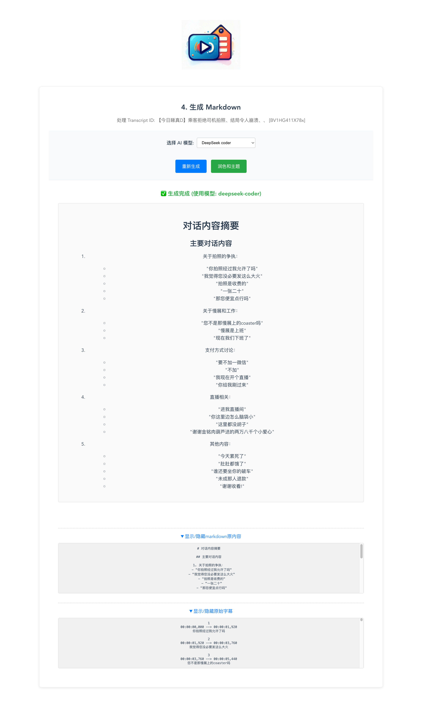
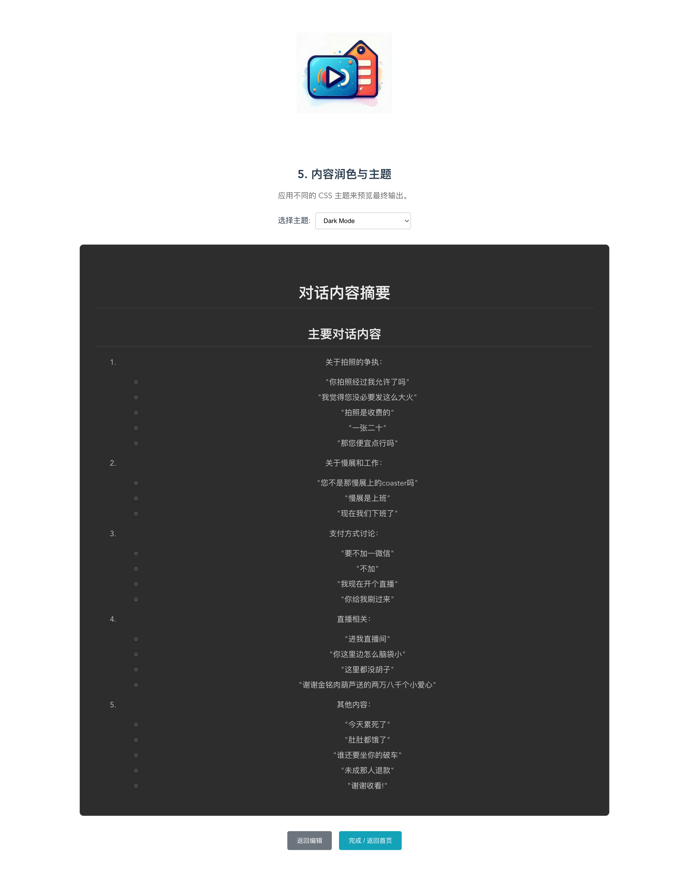

<div align="center">

# NotesAI


</div>

## 简介

NotesAI能够帮用户实现自动下载和分析提供的多模态（包括音视频文本）内容，利用AI生成markdown并形成可视化和高分享度笔记，包括图片/PPT等。 
主要特点和功能：

- 项目打包docker部署，用户可一键部署体验。

- 本地CPU也可运行。

- 使用开源yt-dlp下载音视频，支持主流Youtube、B站等视频下载。

- **支持调用在线大模型服务（whisper系列）识别音视频内容，支持本地下载开源whisper.cpp/faster-whisper（whisperX）/funasr等模型进行音视频内容识别。**

- **支持接入主流大模型（deepseek-v3、gpt-4o、gemini-2.5等）生成笔记，支持本地部署大模型生成笔记。**

- vue界面流程清晰，操作方便。


## 启动运行（docker版）
1、clone项目

2、下载安装DockerDesktop

3、进入video-notes目录下运行docker构建和启动
```bash
docker-compose build
docker-compose up -d
```

4、访问页面
```bash
http://localhost:8080/api/input
```

## 启动运行（非docker版）
1、clone项目(同上)

2、下载安装依赖ffmpeg，nodejs

3、进入video-server目录，启动后端项目
```bash
pip install requirements.txt
python main.py
```

4、进入video-vue目录，启动vue项目
```bash
npm install
npm run serve
```

5、访问页面（同上）


## 操作步骤（视频为例）
### 1、输入视频地址


### 2、视频下载


### 3、字幕内容解析


### 4、生成markdown



### 5、主题及润色


