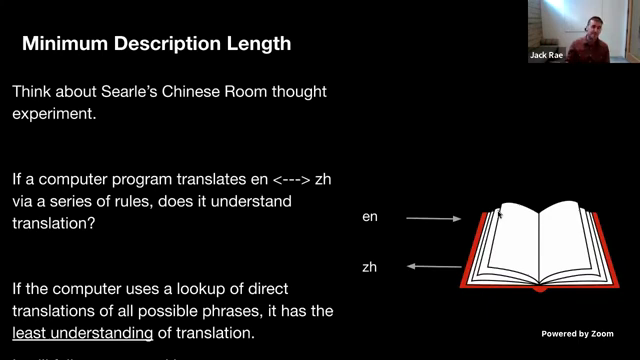

# AGI

Hello, everyone, and welcome to episode 76 of the Stanford Emosis seminar series.Today, of course, we're this year where we're very excited to be partnered with CS324Advances and Foundation Models.Today, I'm joined by Michael, say hi, and Ivoneka, and today, our guest is Jack Ray fromOpenAI.We have a very exciting talk prepared for us about compression and AGI, so we're veryexcited to listen to them.As always, if you have questions, you can post them in YouTube chat or if you're in theclass, there's that Discord channel.So keep the questions coming, and after this talk, we will have a great discussion.So that, Jack, take it away.>> Okay, fantastic.Thanks a lot.Okay, so today, I'm going to talk about compression for AGI, and the theme of this talk is thatI want people to kind of think deeply about foundation models and their training objective,

and think deeply about kind of what are we doing?